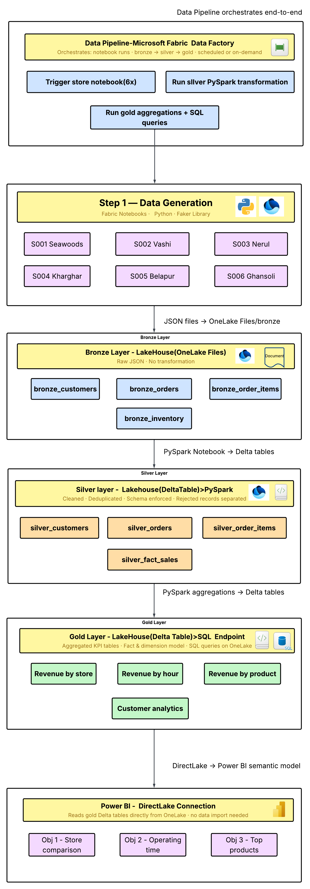
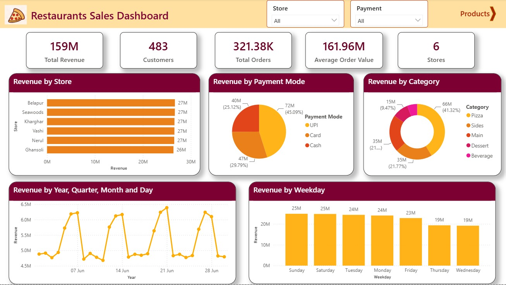
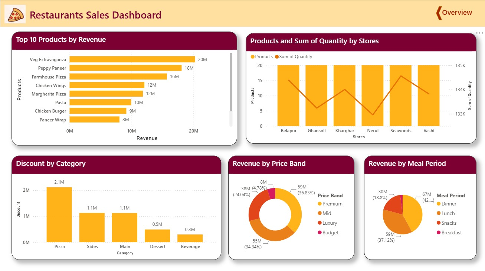

# Restaurant Data Pipeline

This repository contains the end-to-end data pipeline built for analyzing restaurant performance. The data processing, transformation, and storage were implemented using **Microsoft Fabric**.

> **Note on Microsoft Fabric:** 
> The pipeline and analytics were built using a free Microsoft Fabric account. Because of limitations with free workspaces, all the necessary components—including the raw/silver/gold data, notebooks, and SQL scripts—have been downloaded and preserved in this repository for reference and version control.

## Project Structure

The project has been organized into the following folders to make it clean and easy to navigate:

- **`notebooks/`**: Contains all the Jupyter Notebooks used for processing store-level data.
- **`data/`**: Contains the datasets and SQL scripts for the Medallion architecture (Silver and Gold layers).
- **`reports/`**: Contains the final outputs, including the Power BI report (`Restaurant.pbix`) and the Executive Business Report (PDF).
- **`assets/`**: Contains images used for documentation, such as the dashboard screenshots and the architecture pipeline.

## Architecture

## Power BI Dashboard & Reports

We have built a comprehensive Power BI Dashboard to visualize the insights generated from our gold layer data. The interactive report can be found in `reports/Restaurant.pbix`. 

Below are the key snapshots of the dashboard output:

### Dashboard - Overview

### Dashboard - Detailed Insights

## How to use

1. **Notebooks**: The `notebooks/` folder contains scripts used to clean and transform the data (`Store_S001_Seawoods.ipynb`, etc.). You can run them to see the step-by-step transformations.
2. **Data**: You can inspect the SQL schemas in `data/silver` and `data/gold` to understand how the tables were modeled for analytics.
3. **Power BI**: Open `reports/Restaurant.pbix` in Power BI Desktop to interact with the visual reports and explore the datasets further.
